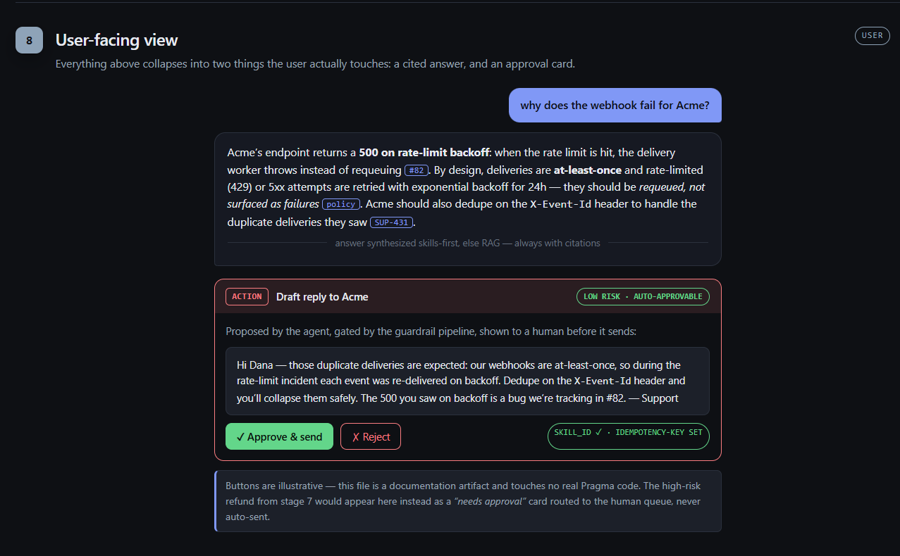

# Pragma

Company intelligence, executable. A knowledge layer + agent action layer for B2B SaaS support teams.

- **Spec / pitch:** [`PRAGMA.md`](PRAGMA.md)
- **Working guide (start here to contribute):** [`CLAUDE.md`](CLAUDE.md)
- **Per-function build plan:** [`docs/BUILD_PLAN.md`](docs/BUILD_PLAN.md)

## What the user sees

Everything Pragma does under the hood — ingest, normalize, chunk, embed, retrieve, cluster into skills, gate actions through guardrails — collapses into two things the end user actually touches: a **cited answer**, and an **approval card** for any action an agent proposes.



- **Answer** — synthesized skills-first, falling back to RAG, and **always cited** back to the source (a GitHub issue, a policy doc, a support ticket). No uncited claims.
- **Action card** — the agent's proposed action (here, a drafted reply) *after* it clears the five-check guardrail pipeline. Low-risk actions are auto-approvable with a one-click human confirm; a high-risk action (e.g. a $5,000 refund) instead lands in the human approval queue as a *needs approval* card and is never auto-sent. Every card carries its `skill_id` and a pre-set idempotency key.

For the full walkthrough of how a raw Slack thread becomes this view — all eight pipeline stages with concrete example data — open the self-contained [`docs/architecture-demo.html`](docs/architecture-demo.html) in a browser.

## Layout

```
backend/    Python service (FastAPI + Celery + Postgres/pgvector)  — all of v1's value
frontend/   React + Vite dashboard (added in Phase 6)
docs/       build plan and design notes
```

## Quick start (local)

```bash
cp .env.example .env          # fill in keys as needed
docker compose up -d          # Postgres (pgvector) + Redis + api + worker + beat

cd backend
pip install -e ".[dev]"       # or: pip install -r requirements.txt
alembic upgrade head          # apply migrations (none yet — Phase 1)
pytest -v                     # run tests
ruff check app/ && ruff format app/
uvicorn app.main:app --reload --port 8000   # http://localhost:8000/health
```

## Status

Phase 0 (foundation) is the current scaffold. See the status board in [`CLAUDE.md`](CLAUDE.md#8-status-board).
